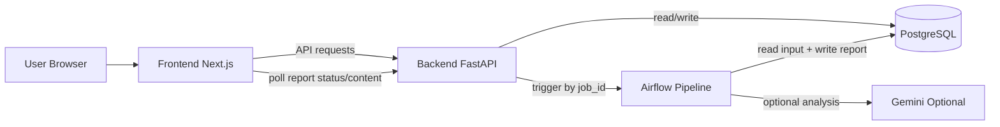

# Revue.ai

Revue.ai is a local career-fit app. You paste job postings, upload a resume PDF, and get a structured report with strengths, gaps, and suggestions.


## What This Repo Runs

- Frontend: Next.js
- Backend: FastAPI
- Database: PostgreSQL (Docker)
- Pipeline: Airflow (Docker, LocalExecutor)

This setup is localhost-first. Cloud hosting config has been removed from the main dev flow.

## How It Works (High Level)

At a high level, the app has five working parts:

- Frontend (Next.js): collects job postings and resume upload, then polls for report status.
- Backend API (FastAPI): handles auth, stores data in Postgres, and triggers Airflow runs.
- PostgreSQL: stores users, job postings, resume file data, and generated reports.
- Airflow pipeline: processes one job_id through extraction, comparison, and report generation.
- Optional LLM (Gemini): improves skill extraction and narrative output when a key is provided.



In short: frontend submits data, backend stores and triggers work, Airflow builds the report, and frontend displays the final result.

## Quick Start

From the repo root:

```bash
make db-up
make db-migrate
make backend-dev
make frontend-dev
```

Open:

- Frontend: http://localhost:3101
- Backend: http://127.0.0.1:8011
- API docs: http://127.0.0.1:8011/docs
- Airflow UI: http://localhost:8080

## Restart Commands

If frontend and backend are down, run each in its own terminal.

Backend:

```bash
cd backend
source ../.env
python -m uvicorn api.main:create_app --reload --port 8011
```

Frontend:

```bash
cd frontend
npm run dev -- --port 3101
```

## Common Fixes

### Port 8011 already in use

```bash
pkill -f "uvicorn api.main:create_app" || true
lsof -ti tcp:8011 | xargs kill -9 2>/dev/null || true
```

Then start backend again.

### Missing Python dependency (example: dotenv)

```bash
cd backend
pip install -r requirements.txt
```

### CORS error from LAN IP (for example 192.168.x.x)

Backend CORS now accepts localhost and local-network origins used during device testing.

### Pipeline stuck at 20%

Use the Docker Airflow stack with bind-mounted DAG and task folders so code updates are live:

```bash
docker compose -f infra/docker-compose.yml --env-file .env up -d airflow-scheduler airflow-webserver
```

If dependencies changed:

```bash
docker compose -f infra/docker-compose.yml --env-file .env build
docker compose -f infra/docker-compose.yml --env-file .env up -d
```

## Optional LLM Mode

The pipeline works without an LLM key using heuristic matching.

To enable Gemini-enhanced analysis:

```bash
export GEMINI_API_KEY=your_key_here
```

## Project Structure

```text
revue/
├── frontend/
├── backend/
├── airflow/
├── infra/
├── vector_db/
├── Makefile
└── README.md
```