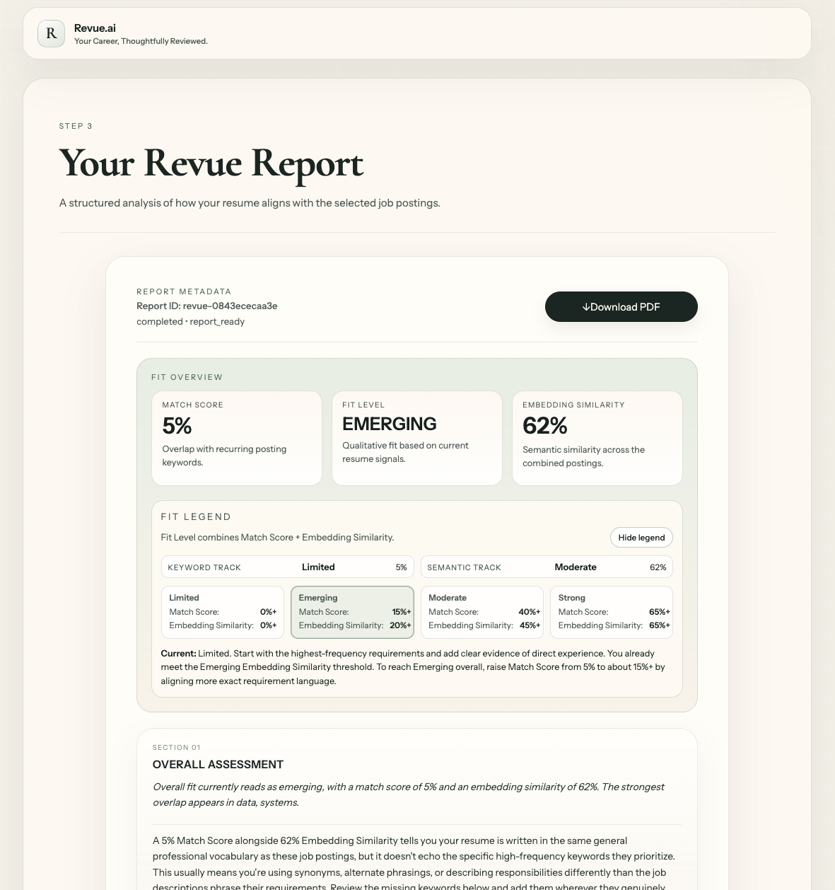
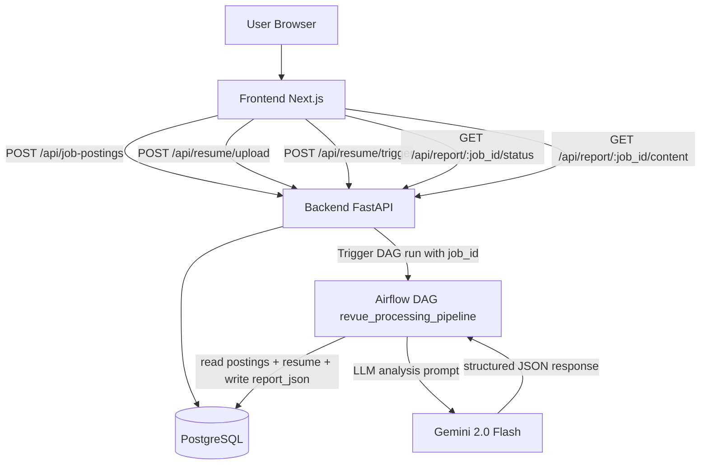
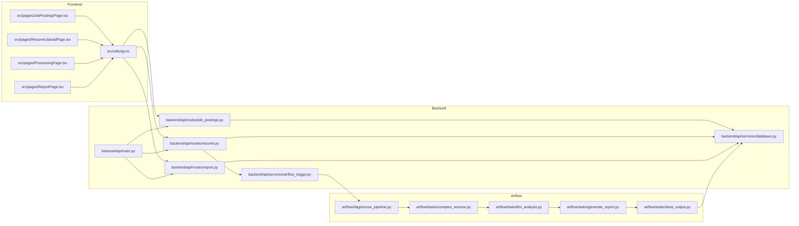
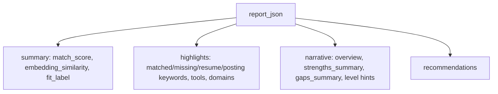

# Revue.ai

Revue.ai is a career review tool: paste job postings, upload a resume, and get a structured alignment report with matched skills, missing signals, and concrete recommendations.


## System Flow



## File Communication Map



## Pipeline Stages (Current)

```mermaid
flowchart LR
		A[extract_resume_text_step]
		B[build_initial_payload]
		C[clean_step]
		D[resume_features_step]
		E[compare_step - heuristic overlap]
		F[llm_analysis_step - Gemini skills + narrative]
		G[embeddings_step - hashed vector similarity]
		H[report_step - assemble report_json]
		I[store_step - persist report]

		A --> B --> C --> D --> E --> F --> G --> H --> I
```



`llm_analysis_step` is fallback-safe. If `GEMINI_API_KEY` is not set (or `google-genai` is unavailable), the pipeline continues with heuristic comparison output.

## Report JSON Shape



## Repository Layout

```text
revue/
├── frontend/
│   └── src/
│       ├── pages/
│       ├── components/
│       ├── context/
│       ├── styles/
│       └── utils/
├── backend/
│   ├── api/
│   │   ├── main.py
│   │   ├── routes/
│   │   ├── schemas/
│   │   └── services/
│   └── migrations/
├── airflow/
│   ├── dags/
│   └── tasks/
├── vector_db/
├── infra/
│   ├── docker-compose.yml
│   └── terraform/
├── Makefile
└── README.md
```

## Local Development

Start services from the repo root:

```bash
make db-up
make db-migrate
make backend-dev
make frontend-dev
```

Useful defaults:

- Frontend: `http://localhost:3101`
- Backend: `http://127.0.0.1:8011`
- Backend docs: `http://127.0.0.1:8011/docs`
- Database: `localhost:5434`

Install/update Airflow Python dependencies (after `airflow/requirements.txt` changes):

```bash
docker compose -f infra/docker-compose.yml build airflow
docker compose -f infra/docker-compose.yml up -d airflow
```

To enable LLM analysis in pipeline runs:

```bash
export GEMINI_API_KEY=your_key_here
```

## Notes

- Frontend report download now uses a clean print document generated from `buildPreviewHtml` in `ReportPage.tsx`.
- `compare_step` still provides deterministic baseline behavior.
- `llm_analysis_step` upgrades extracted skills and narrative quality when available.